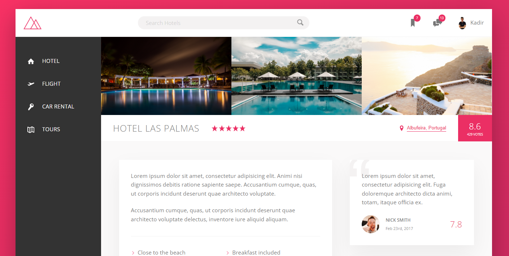
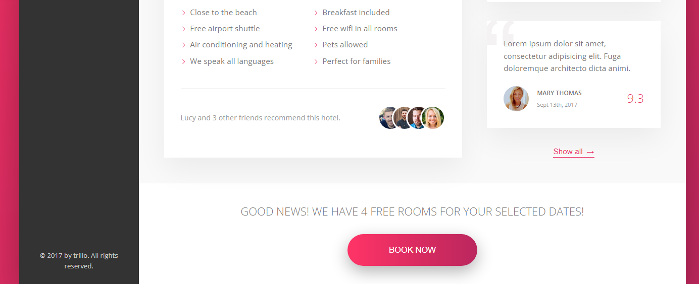

# 🏨 Trillo-Page

Trillo is a landing page for hotel rental and travel application which i create for practice flex structure.  
I aim to make this site really useful by adding many Javascript features in the future.

## What features do I have in this application?

* Nice hover effects on navigation bar and CTA.
* Full responsive layout for whole devices.
* Nicely chosen color harmony and modern look.
* Expanding searchbar on focus event.
* User reviews and ratings for more reality look.

## Which tools i used?

* NPM
* SCSS
* HTML5
* CSS3
* <a href="https://icomoon.io/"> IcoMoon svg provider </a>
## Screenshots

